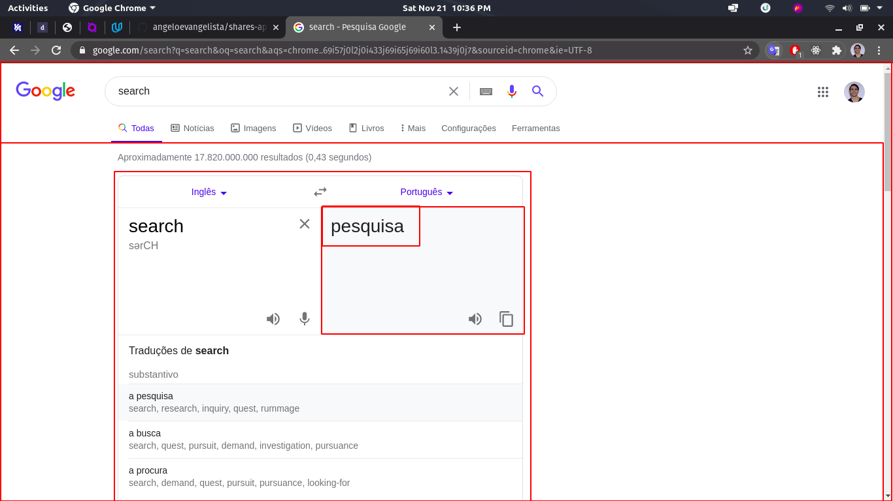
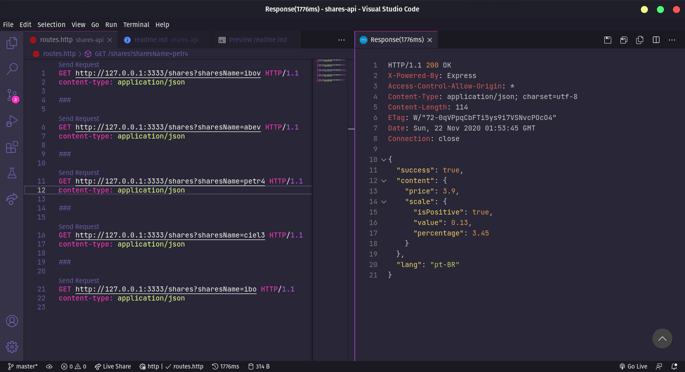

# Shares API

# ⚠️ Attention

This API doesn't have a database or anything like this to get own information or to be stable and independent by itself. This is just a crawler that uses google searches to treat information and serve it as a rest API. Keep in mind if google's page layout changes, this API can become obsolete.

Just keep it in mind and make it useful for You.

# How does it work?

This API uses the google's page layout to make searches about the share's prices and serialize into JSON format to be used for clients, programs like dashboards, graphs, etc...



Using this page as example, we can say that all of this areas in red are elements of DOM. Then, we can simply simulate a navigation using JavaScript to get elements and its content.

For example, if we would like to get the translate of the text, we can use this 'map':

`#search div div div div div g-expandable-container div div div.tw-src-ltr div.oSioSc div div.g9WsWb div.tw-ta-container pre span`

And then, using JavaScript QuerySelector we could do something like this:

```javascript
const queryString =
  '#search div div div div div g-expandable-container div div div.tw-src-ltr div.oSioSc div div.g9WsWb div.tw-ta-container pre span';

const translateElement = document.querySelector(queryString);

const translateText = translateElement
  ? translateElement.textContent
  : undefined;

console.log(translateText);
// it results the content of element, or undefined
```

And that is basically how it works.

# How to run

clone this repo using git cli

```bash
git clone https://github.com/angeloevangelista/shares-api.git
```

Open the project folder and execute `yarn` to get the project dependencies, or `npm install`. Be free to choose your favorite.

After that, use the `start` script to run the development server

# How to use

The use of this API its very simple, just pass a query param called `sharesName` to `shares` route and be happy:

`http://127.0.0.1:3333/shares?sharesName=petr4`

You can find examples of calls of `routes.http` file.


